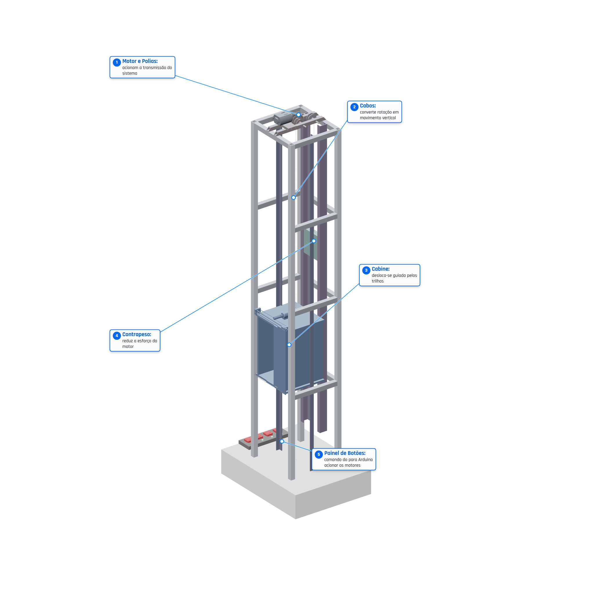
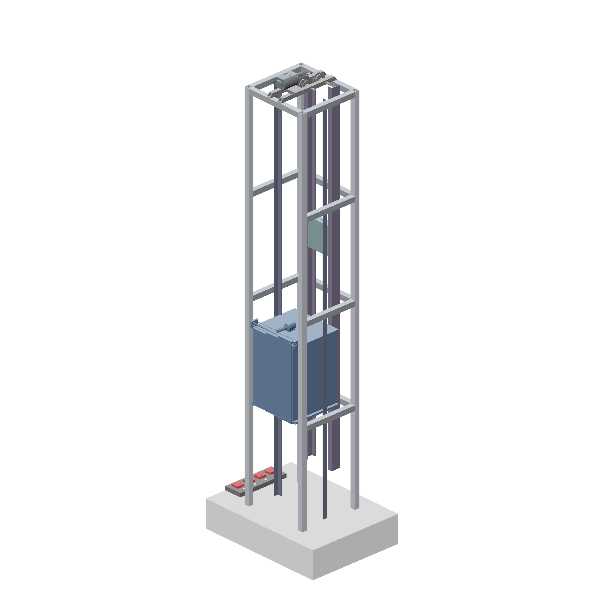

# APS Eng. Mecânica UNIP 2026 — Elevador em Escala Reduzida

🔗 **Tour virtual 3D (publicado):** https://victorromao011.github.io/APS-ENG-MEC-UNIP-2026/

> Atividade Prática Supervisionada (APS) — Engenharia Mecânica
> Universidade Paulista (UNIP) · Instituto de Ciências e Tecnologia (ICET) · Campus Jundiaí
> APS 2026/1 — **Equipe Altus**: *"Elevando segurança, precisão e inovação"*



## Sobre o projeto

Protótipo funcional de **elevador em escala reduzida**, com transmissão por cabos, polias,
contrapeso e acionamento elétrico, totalmente modelado em ambiente 3D (FreeCAD) e
apresentado através de um **tour virtual interativo 360°** rodando direto no navegador
(Three.js), sem necessidade de instalar nenhum software de CAD.

O modelo é composto por **23 componentes principais**, com memorial técnico completo de
dimensionamento (estrutural, torque, potência, transmissão, cabos e estabilidade).

## Equipe Altus

- Victor Romão
- Gabriela Ferraz
- Mikael Campos
- Vitória Cristina
- Pedro Pelline
- Laura Casadei

## Tour virtual 3D

O arquivo `index.html` é um visualizador 3D autocontido (Three.js r128) que carrega a malha
do modelo CAD exportado do FreeCAD e permite:

- Rotação livre do modelo (orbit controls customizados) e vistas pré-definidas (Frontal,
  Lateral, Superior, Isométrica);
- Modo **explodido** (separa os componentes para visualizar a montagem);
- Modo com **medidas/cotas** sobre o modelo;
- Exportação de imagens em alta qualidade, incluindo a versão com **balões numerados**
  explicando os 5 sistemas principais (ver imagem acima).

> Como o `fetch`/carregamento da malha depende de ser servido via HTTP, o tour funciona
> publicado no GitHub Pages (link no topo) ou localmente via `python -m http.server`.
> Abrir o `index.html` com duplo clique (`file://`) pode não carregar corretamente.

## Sistema e funcionamento (5 subsistemas)

| # | Subsistema | Componentes do modelo | Função |
|---|---|---|---|
| 1 | **Motor e Polias** | Motor, Corona, Polia do Contrapeso, Eixo da Polia 01, Eixo da Polia 02, Viga das Polias | Aciona a transmissão do sistema |
| 2 | **Cabos** | Cabo da Cabine, Cabo do Contrapeso | Converte rotação em movimento vertical |
| 3 | **Cabine** | Cabine | Desloca-se guiada pelos trilhos (guias verticais) |
| 4 | **Contrapeso** | Contrapeso | Reduz o esforço exigido do motor |
| 5 | **Painel de Botões** | Painel de Botões, Botões, Leds, Comutador | Comando (Arduino) para acionar os motores |

## Modelo 3D — 23 componentes

Modelado em **FreeCAD** (`Ascensor5.FCStd`). Dimensões obtidas pela caixa envolvente (bounding
box) de cada peça do modelo 3D — usadas como base para o memorial de cálculo.

| Item | Componente | X — largura (mm) | Y — profund. (mm) | Z — altura (mm) | Acabamento/material |
|---|---|---|---|---|---|
| 01 | Base | 200.0 | 150.0 | 43.0 | concreto claro brilhante tipo LEGO |
| 02 | Painel de Botões | 28.0 | 81.0 | 6.0 | aço grafite brilhante |
| 03 | Botões | 12.8 | 68.7 | 8.4 | vermelho industrial brilhante |
| 04 | Leds | 3.6 | 61.0 | 8.4 | verde indicador brilhante |
| 05 | Comutador | 23.5 | 11.9 | 7.3 | metálico fosco/brilhante leve |
| 06 | Vigas Horizontais | 108.0 | 92.0 | 458.0 | alumínio brilhante |
| 07 | Viga Frontal | 92.0 | 8.0 | 8.0 | alumínio claro brilhante |
| 08 | Bancada | 37.0 | 16.0 | 4.0 | aço escovado brilhante leve |
| 09 | Motor | 20.0 | 50.0 | 15.0 | motor metálico real |
| 10 | Guias da Cabine | 92.0 | 7.0 | 600.0 | aço azulado brilhante |
| 11 | Guias do Contrapeso | 52.0 | 14.0 | 550.0 | aço técnico brilhante |
| 12 | Portas | 73.0 | 4.9 | 118.0 | azul industrial brilhante |
| 13 | Contrapeso | 48.0 | 10.0 | 54.8 | verde metálico brilhante |
| 14 | Cabo da Cabine | 2.1 | 10.9 | 335.0 | aço brilhante |
| 15 | GanchoCabina | 4.0 | 0.6 | 17.6 | aço polido |
| 16 | Corona | 14.0 | 26.4 | 26.4 | grafite brilhante |
| 17 | Verticales | 108.0 | 100.0 | 603.0 | alumínio estrutural brilhante |
| 18 | Cabine | 84.0 | 79.6 | 120.6 | azul industrial (igual às portas) |
| 19 | Cabo do Contrapeso | 1.9 | 35.6 | 199.7 | aço fosco brilhante leve |
| 20 | Polia do Contrapeso | 14.0 | 16.0 | 16.0 | polia metálica |
| 21 | Eixo da Polia 01 | 40.0 | 2.4 | 2.4 | cromado |
| 22 | Eixo da Polia 02 | 40.0 | 2.4 | 2.4 | cromado |
| 23 | Viga das Polias | 26.0 | 100.0 | 6.0 | aço estrutural brilhante |



## Memorial de cálculo — premissas e resultados

Memorial de cálculo estrutural e de desenvolvimento, usando as dimensões extraídas do
modelo 3D. Como o projeto acadêmico não informa massa real medida, potência do motor,
material definitivo e velocidade exigida, os resultados usam premissas técnicas
conservadoras para um prototipo em escala reduzida (fator de segurança = 2,0).

**Premissas adotadas**

| Parâmetro | Valor adotado | Justificativa |
|---|---|---|
| Unidade dimensional | milímetro (mm) | compatível com o modelo 3D |
| Gravidade (g) | 9,81 m/s² | valor padrão |
| Massa cabine estimada | 0,45 kg | cabine + portas em prototipo leve |
| Carga útil estimada | 0,30 kg | ensaio acadêmico em escala reduzida |
| Contrapeso projetado | 0,57 kg | cabine + 40% da carga útil |
| Velocidade de elevação | 0,05 m/s | movimento visível e seguro em bancada |
| Fator de segurança | 2,0 | prototipo didático |

**Resultados finais de dimensionamento**

| Grandeza calculada | Resultado | Observação |
|---|---|---|
| Massa total movida | 0,75 kg | cabine + carga útil |
| Contrapeso recomendado | 0,57 kg | cabine + 40% carga |
| Velocidade linear | 0,050 m/s | aprox. 3,0 m/min |
| Rotação da coroa/polia | 36,2 rpm | para D = 26,4 mm |
| Rendimento global | 73,7 % | polias + engrenagem + mancais |
| Torque de projeto | 0,063 N·m | com FS = 2 |
| Potência mínima calculada | 0,325 W | usar motor ≥ 1 W |
| Relação de engrenagens sugerida | 3,33:1 | z1 = 12 / z2 = 40 |
| Módulo sugerido | m = 1,0 mm | prototipo didático |
| Diâmetro mínimo do eixo | 2,00 mm | eixo existente ≈ 2,4 mm |
| Diâmetro mínimo do cabo | 0,61 mm | cabos existentes ≈ 1,9–2,1 mm |
| Flecha da viga das polias | 0,334 mm | baixa para prototipo |

**Modelo de balanceamento (contrapeso)**

```
m_total      = m_cabine + m_carga       = 0,45 + 0,30 = 0,75 kg
m_contrapeso = m_cabine + 0,40*m_carga  = 0,45 + 0,40*0,30 = 0,57 kg
Delta m      = m_total - m_contrapeso   = 0,18 kg
```

**Recomendações finais de desenvolvimento**

| Item | Recomendação |
|---|---|
| Motor | usar motor com redutor ou controle PWM, torque nominal ≥ 0,06 N·m no eixo de saída |
| Contrapeso | ajustar por ensaio até a cabine subir e descer sem trancos |
| Cabos | usar cabo/linha sem elasticidade excessiva e com boa fixação no gancho |
| Polias | alinhar eixos, evitar atrito lateral e cantos vivos no caminho do cabo |
| Guias | manter paralelismo; lixar ou polir pontos de contato da cabine |
| Base | aumentar massa da base ou fixar em bancada se houver vibração |
| Ensaio | testar sem carga, depois com carga progressiva de 50 g em 50 g |

> Conclusão: com as premissas adotadas, o sistema é viável como protótipo acadêmico em
> escala reduzida. O conjunto tem baixo torque exigido por causa do contrapeso, e os
> eixos/cabos representados no modelo possuem dimensões superiores aos mínimos calculados.
> A validação final depende de ensaio físico com as massas reais.

## Stack técnico

- **Modelagem 3D:** FreeCAD (`Ascensor5.FCStd`) — 23 objetos paramétricos (`Part::Feature`,
  `Part::Compound`, `Array`, `Sweep`, `Pad`, `Pocket`, `Chamfer`).
- **Visualização web:** Three.js r128 (via CDN), com malhas exportadas do FreeCAD e
  embutidas diretamente no `index.html` (sem dependência de arquivos externos `.stl`/`.gltf`).
- **Tour 360°:** controles de câmera customizados (Frontal/Lateral/Superior/Isométrica),
  modo explodido, anotações/medidas e exportação de imagens em alta resolução (PNG, com
  e sem balões explicativos).
- **Publicação:** GitHub Pages, servindo o `index.html` diretamente da branch `main`.

## Estrutura do repositório

| Arquivo | Função |
|---|---|
| `index.html` | Tour virtual 3D completo (HTML + CSS + JS + malha do modelo embutidos) |
| `assets/preview-sistemas.png` | Render do modelo com balões explicando os 5 subsistemas |
| `assets/preview-solido.png` | Render sólido do modelo completo (23 componentes) |
| `README.md` | Este arquivo |
